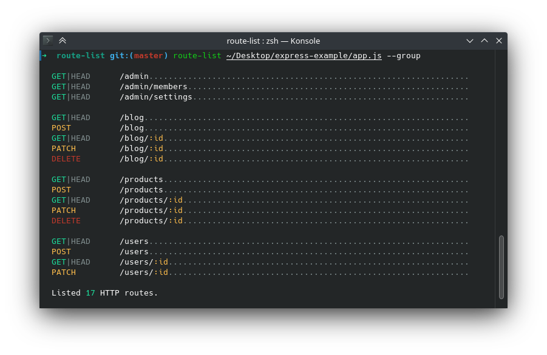

# route-list


[](https://github.com/VladimirMikulic/route-list/actions)
[](https://twitter.com/VladoDev)

> ✨ Beautifully shows Express/Koa/Hapi/Fastify routes in CLI.



## 📦 Installation

```sh
# Installs the package so it's globally accessible in terminal
npm i route-list -g
```

## 🔌 Configuration

Before you can use `route-list` on your project, we first need to make sure it's configured properly.
In order for `route-list` to work, we need to export server "app".
The example below is for Express but it also applies to Koa (with @koa/router)/Hapi/Fastify.

**app.js** / **app.ts**

```js
const app = express();

app.get('/', (req, res) => res.sendStatus(200));
app.get('/products', (req, res) => res.sendStatus(200));
app.get('/products/:id', (req, res) => res.sendStatus(200));

// CJS
// Option 1: module.exports = app;
// Option 2: module.exports = { app, yourOtherExports... };
// Option 3: module.exports = functionThatReturnsApp;

// ESM
// Option 1: export default app;
// Option 2: export default { app, yourOtherExports... };
// Option 3: export default functionThatReturnsApp;
```

> NOTE: In case you use [SocketIO with Express](https://socket.io/get-started/chat#the-web-framework), make sure to **export Express app**, not `http.createServer` server instance.

## ☁️ Usage

### Options

- `-g, --group` - Display routes in groups separated with new line
- `-m, --methods <methods>` - Include routes registered for HTTP method(s)
- `-i, --include-paths <paths>` - Include routes starting with path(s)
- `-e, --exclude-paths <paths>` - Exclude routes starting with path(s)

### Examples

```sh
route-list server/app.js
```

```sh
route-list --group server/app.js
```

```sh
route-list --methods GET,POST server/app.js
```

> NOTE: In case an app is part of NX monorepo, make sure to build it first.

## 💻 Programmatic Usage

```js
import RouteList from 'route-list';

// Example result { "/": ["GET"], "/users": ["GET", "POST"] }
const routesMap = RouteList.getRoutes(app, 'express');

// Print routes to console
RouteList.printRoutes(routesMap);
```

## 👨 Author

**Vladimir Mikulic**

- Twitter: [@VladoDev](https://twitter.com/VladoDev)
- Github: [@VladimirMikulic](https://github.com/VladimirMikulic)
- LinkedIn: [@vladimirmikulic](https://www.linkedin.com/in/vladimir-mikulic/)

## 🤝 Contributing

Contributions, issues and feature requests are welcome!

## 🍻 Credits

The project was inspired by new `route:list` command in Laravel 9.
New [`route:list`](https://github.com/laravel/framework/pull/40269) itself was
inspired by [`pretty-routes`](https://github.com/Wulfheart/pretty-routes) project.
Big thanks to [Λlex Wulf](https://twitter.com/alexfwulf) for building
`pretty-routes` and Laravel community for recognizing the usefulness of the project.

## ✏️ License

This project is licensed under [MIT](https://opensource.org/licenses/MIT) license.

## 👨‍🚀 Show your support

Give a ⭐️ if this project helped you!
